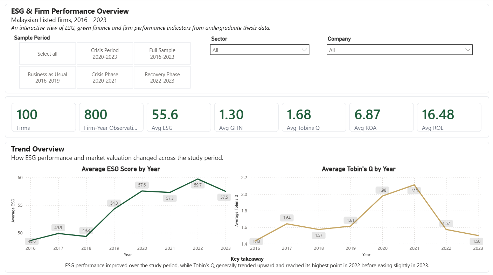
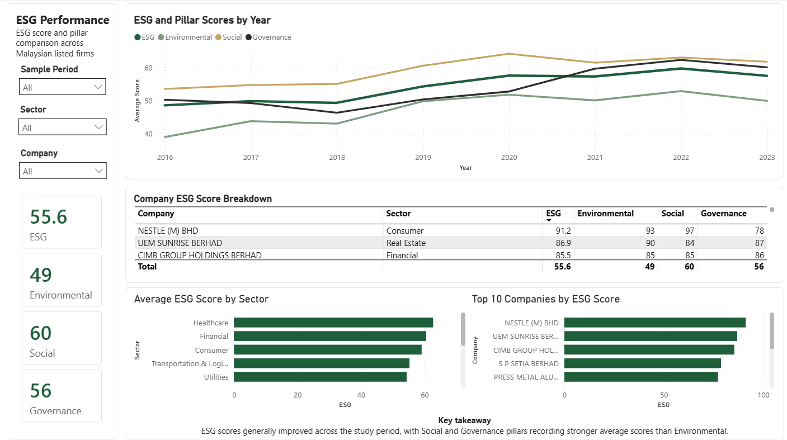
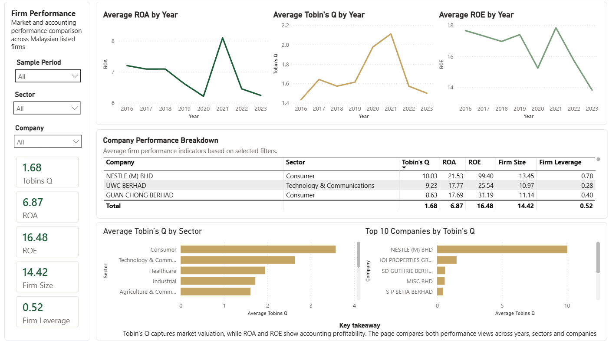
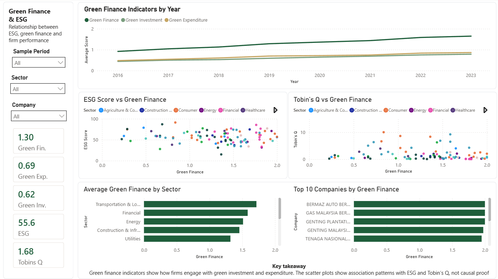
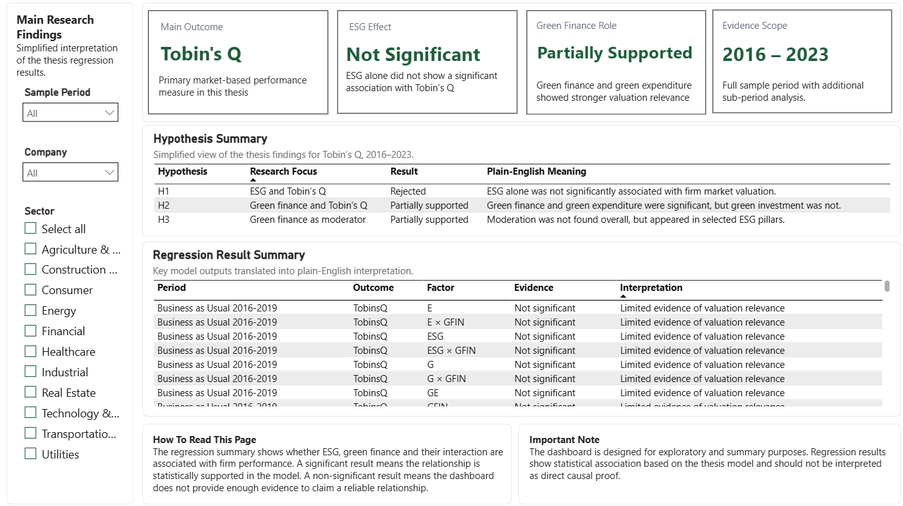

# ESG & Firm Performance Dashboard

## Project Overview

This Power BI dashboard analyses ESG performance, green finance indicators, and firm performance among Malaysian listed firms from 2016 to 2023. The project translates undergraduate thesis data into an interactive dashboard for exploring ESG trends, sector comparisons, green finance patterns, and research findings in a more accessible way.

## Repository Structure

```text
esg-firm-performance-dashboard/
│
├── README.md
├── powerbi/
├── data/
├── images/
└── documentation/
```

## Dashboard Pages

1. **Overview**  
   Summarises key indicators such as ESG score, green finance, Tobin’s Q, ROA and ROE.

2. **ESG Performance**  
   Shows ESG and pillar score trends across Environmental, Social and Governance dimensions.

3. **Firm Performance**  
   Compares market-based and accounting-based performance through Tobin’s Q, ROA and ROE.

4. **Green Finance & ESG**  
   Explores how green finance indicators relate to ESG performance and Tobin’s Q.

5. **Research Summary**  
   Presents simplified thesis findings, hypothesis summary and regression interpretation.

## Tools Used

- Power BI
- Excel
- Power Query
- DAX
- GitHub

## Dataset

The dashboard uses firm-year data for Malaysian listed firms from 2016 to 2023. The dataset includes ESG scores, green finance indicators, firm performance variables and selected control variables.

Main variables include:

- ESG
- Environmental
- Social
- Governance
- Green Finance
- Green Investment
- Green Expenditure
- Tobin’s Q
- ROA
- ROE
- Firm Size
- Firm Leverage

## Dashboard Preview

### Overview



### ESG Performance



### Firm Performance



### Green Finance & ESG



### Research Summary



## Key Insights

- ESG scores generally improved across the study period.
- Social and Governance pillars recorded stronger average scores than Environmental.
- Tobin’s Q generally trended upward and reached its highest point before easing slightly.
- Green finance and green expenditure showed stronger valuation relevance than ESG alone.
- Regression findings suggest association patterns, not direct causal proof.

## Research Summary

The thesis findings indicate that ESG performance alone did not show a statistically significant association with Tobin’s Q. However, green finance indicators showed stronger valuation relevance, especially the composite green finance measure and green expenditure. The moderating role of green finance was partially supported through selected ESG pillar interactions.

## Important Note

This dashboard is designed for exploratory and summary purposes. Regression results show statistical association based on the thesis model and should not be interpreted as direct causal proof.
